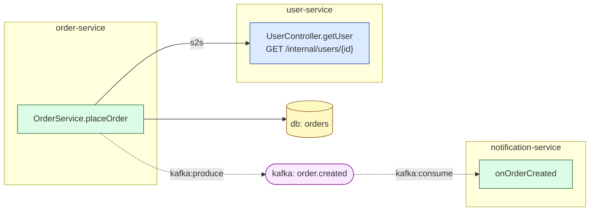

# flowmap 시각화 가이드 (RENDERING)

[SCHEMA.md](SCHEMA.md)의 데이터를 화면에 그릴 때의 권장 규칙입니다. (스타일은 취향껏 바꿔도
되지만, "무엇을 무엇으로 구분해야 하는지"는 지키는 게 좋습니다.)

## 1. 노드 — 레이어로 색, 종류로 모양

| layer | 색(예) | 모양(예) | 비고 |
|---|---|---|---|
| CONTROLLER | 파랑 | 둥근 사각 | 진입점. `endpoint`(URL)를 라벨/서브라벨에 |
| SERVICE | 초록 | 사각 | |
| REPOSITORY | 노랑 | 사각 | |
| COMPONENT | 청록 | 사각 | |
| CONFIG | 회색 | 사각 | |
| BATCH | 보라 | 사각 | Job/Step/Reader/… |
| EXTERNAL | 빨강 | 평행사변형 | 3rd-party. `externalUrl`/`externalService` 표시 |
| RESOURCE | (아래) | (아래) | `resourceType`로 세분 |
| OTHER | 연회색 | 사각 | 보통 기본 숨김 |

**RESOURCE는 `resourceType`으로 구분** (인프라라 모양을 다르게 주면 직관적):

| resourceType | 색(예) | 모양(예) | 라벨 |
|---|---|---|---|
| `kafka-topic` | 자홍 | 원통/육각 | 토픽명(`method`) |
| `db-table` | 황토 | 원통(DB) | 테이블명 |
| `redis` | 분홍 | 원통 | `Redis` |

노드 라벨: 기본 `method`(또는 `Class.method`), 컨트롤러는 `httpMethod endpoint`를 같이.
`description`이 있으면 툴팁/서브텍스트로(한글 API 설명).

## 2. 엣지 — `mode`로 선, `kind`로 색/의미

- **`mode`**: `sync` = 실선, **`async` = 점선**. (가장 중요한 시각 구분)
- **`kind`별 색/라벨**:

| kind | 색(예) | 라벨/표현 |
|---|---|---|
| `internal` | 회색 | 없음(기본 호출) |
| `s2s` | 굵은 파랑 | "S2S" — **서비스 경계를 넘는 호출**, 강조 |
| `external` | 빨강 | 화살표 끝에 외부 표시 |
| `batch` | 보라 | `relation`의 `batch:*` 라벨 |
| `resource` | `relation`별 | `kafka:produce/consume`, `db:io`, `redis:io` |

화살표 방향 = 호출 방향(`source → target`). Kafka는 자연히 `producer →(produce) topic
→(consume) consumer`로 흐름이 읽힙니다.

엣지 클릭 시: `callSiteFile:callSiteLine`으로 "어디서 호출하는지" 코드 위치 표시(점프 링크).

## 3. 그룹핑 — `project`로 묶기 (MSA의 핵심 뷰)

`project`별로 **클러스터/서브그래프(박스)** 로 묶으면 서비스 경계가 보입니다.

- 박스 안: 그 서비스의 internal 호출 그래프
- 박스를 넘는 엣지: `s2s`(HTTP) 또는 `kafka:*`(이벤트) → MSA 의존도가 한눈에
- RESOURCE 노드(`project: null`)는 **공유 영역**(박스 밖)에 두고 여러 서비스가 연결되게

**서비스 레벨 요약 뷰**도 유용: 노드=서비스, 엣지=서비스 간 s2s/kafka 집계(굵기=호출 수).
드릴다운하면 메서드 레벨 그래프로.

## 4. 스케일 대응

`tera-cloud-user`처럼 700+ 노드인 그래프가 있습니다. 그대로 다 그리면 못 봅니다.

- **기본 필터**: `OTHER` 레이어 숨김, 한 번에 1~2개 `project`만, 또는 레이어 토글.
- **접기(collapse)**: 클래스(`fqcn`) 단위 또는 서비스 단위로 묶었다가 펼치기.
- **검색/포커스**: 특정 노드 기준 N-hop 이웃만(분석기 `search`도 같은 BFS 서브그래프를 JSON으로 제공 — `--method`, `--direction callers|callees`, `--depth`).
- **레이아웃**: 레이어/계층형(controller→service→repository→resource 좌→우)이 호출 흐름과 잘 맞음. 큰 그래프는 force-directed + 클러스터.

## 5. 여러 파일 머지 (필수)

각 `graphs/*.json`은 한 서비스 관점. 전체 지도는 **모든 파일 union**으로 만듭니다
(README "전체 지도를 만들려면" 절 / 의사코드 참고). 핵심:

- 노드는 `id`로 dedup, **`file`이 채워진 노드 우선**(다른 파일의 스텁은 `file:null`).
- 엣지는 `(source,target,relation,callSiteLine)`로 dedup.
- 서로 다른 서비스 파일이 **같은 `id`(s2s 타깃 / `kafka:<topic>`)** 로 자동 연결됨.

## 6. 라이브러리 제안

node-link(JSON) 그대로 먹는 게 많습니다:
- **Cytoscape.js** — 클러스터/계층 레이아웃·스타일·인터랙션 강력(대규모에 적합, 추천).
- **vis-network**, **sigma.js** — 대규모 force 그래프.
- **D3-force / elkjs** — 커스텀 레이아웃.
- 정적/문서용은 **Mermaid**(아래) 또는 Graphviz로도 충분.

데이터 → 라이브러리 매핑은 거의 1:1입니다(`nodes[].id`, `edges[].source/target`). `kind`·`layer`·
`mode`·`resourceType`을 스타일 클래스로 매핑만 하면 됩니다.

## 7. Mermaid 미니 예시 (개념 확인용)

머지된 그래프에서 발췌하면 이런 그림이 됩니다(점선=async/이벤트, s2s=서비스 간):

## 8. 체크리스트 (렌더러가 꼭 처리할 것)

- [ ] `mode==async` → 점선
- [ ] `kind==s2s` 강조 + `project` 박스 넘나드는 엣지로 표현
- [ ] `kind==resource` → `relation`별(kafka/redis/db) 구분, RESOURCE 노드는 공유 영역
- [ ] `layer`별 색, `resourceType`별 모양
- [ ] `project`별 그룹 박스 + 서비스 레벨 요약 뷰
- [ ] 컨트롤러 노드에 `httpMethod endpoint`, 있으면 `description`(한글)
- [ ] 노드/엣지 클릭 → `file:line` / `callSiteFile:callSiteLine` 코드 위치
- [ ] 여러 `graphs/*.json` 머지(`id` dedup, `file` 채워진 것 우선)
- [ ] 대규모(700+) 대비 필터/접기/포커스
